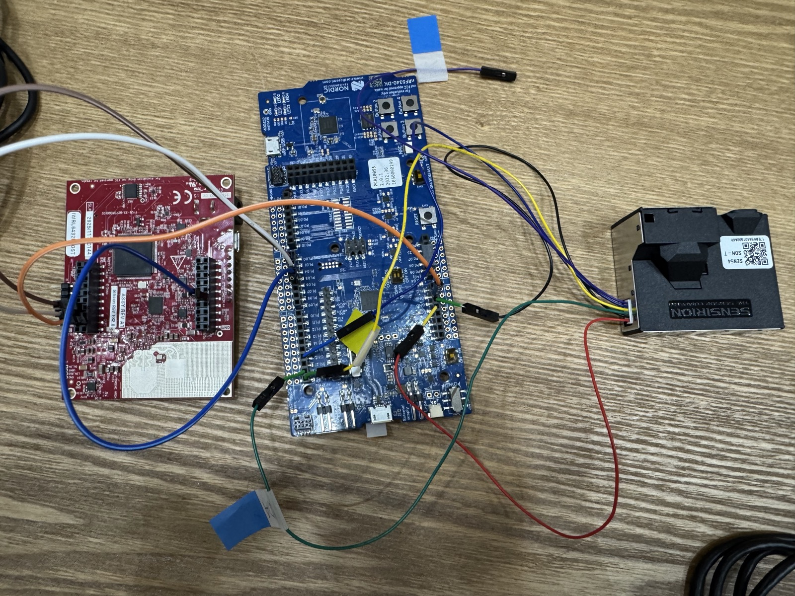
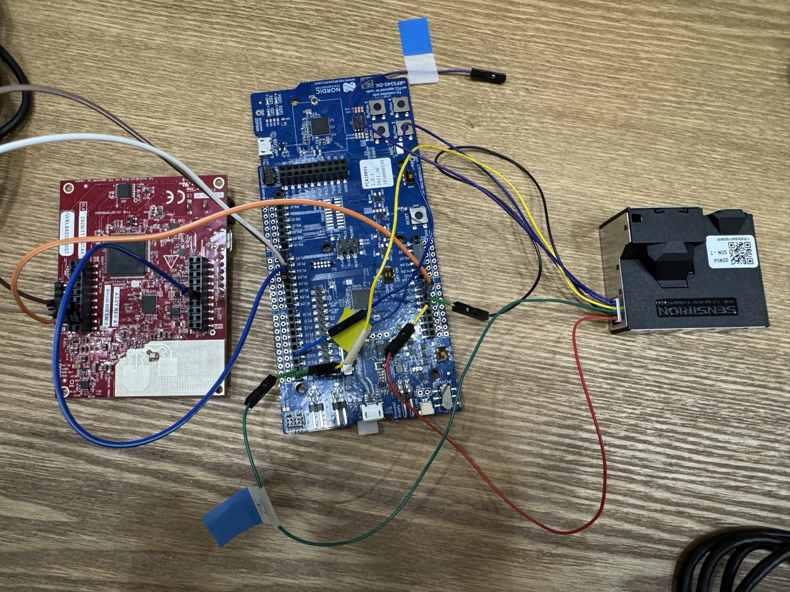
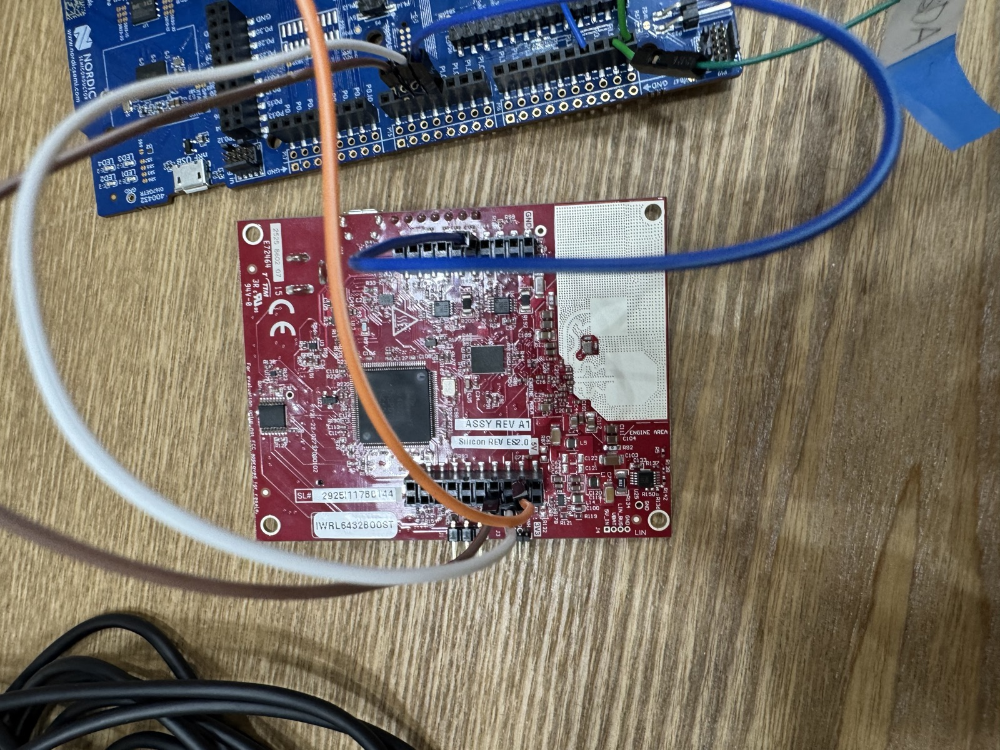
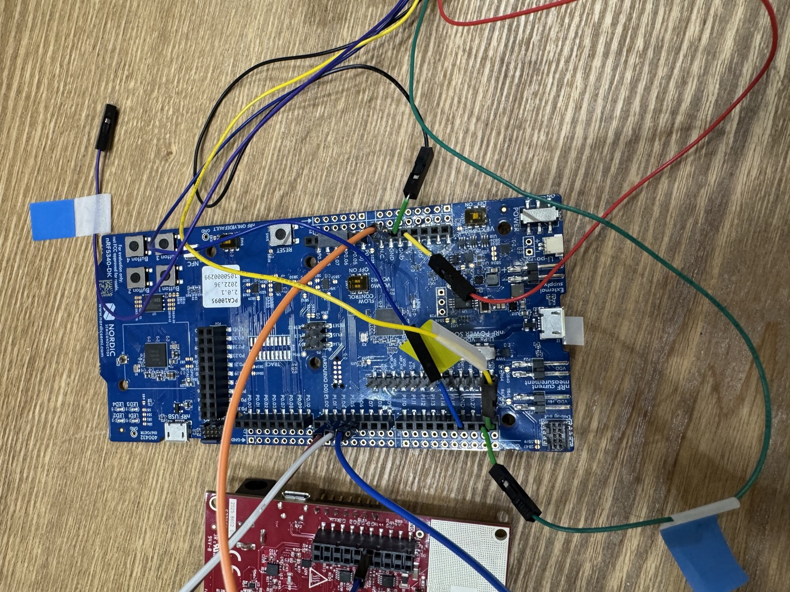
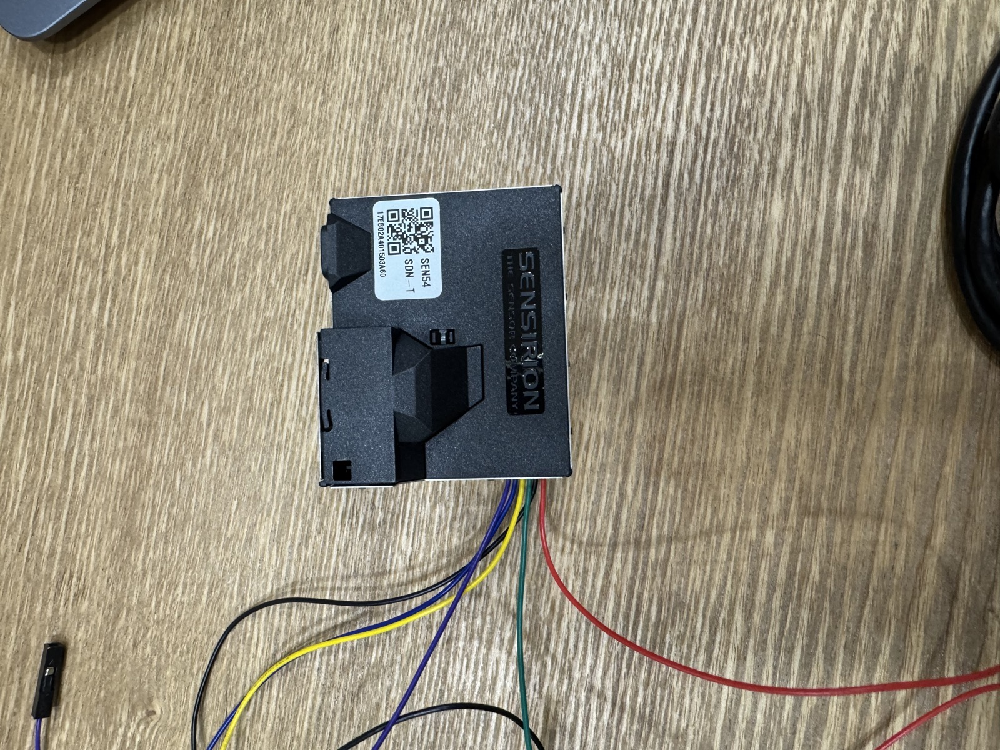
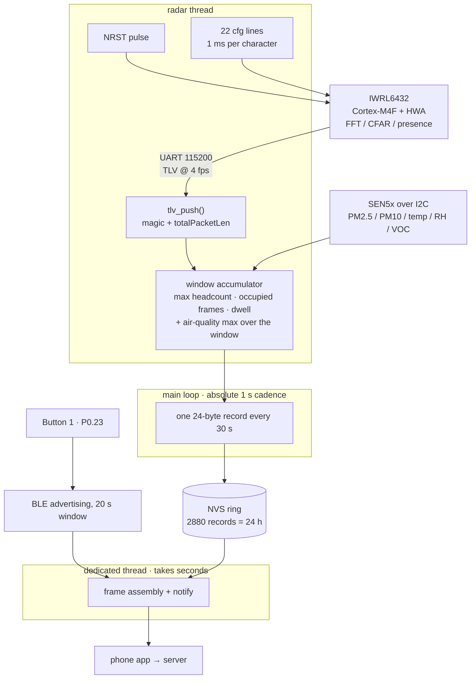

# IWRL6432 — mmWave Presence Radar

> **Sentinel Labs** — the presence-sensing half of a construction-site dust
> monitoring system, built under the **Startup for All (모두의 창업)** startup
> program.

Per-zone presence and motion detection with a TI IWRL6432BOOST (60 GHz mmWave).
An **nRF5340 Zephyr node** drives the radar over UART, reads a Sensirion SEN5x
over I2C, keeps 24 h of combined occupancy + air-quality records in flash, and
hands them to a phone over BLE. The Python tooling in
`tools/` does the same job from a PC, and is what the bring-up was done with.

## The bench



Left: **IWRL6432BOOST** (60 GHz mmWave), on UART. Centre: **nRF5340 DK** host.
Right: **Sensirion SEN54** on I2C — not a separate node, it is the air-quality
half of *this* one, and its PM / temp / RH / VOC ride in the same 24-byte record
as the radar's occupancy. The two boards take their own USB power and share
only GND.



| | |
|---|---|
|  |  |
| The EVM. UART and NRST are tapped from the LP/BP connectors (J8/J9) — no soldering. | The DK side of the same three wires, plus the SEN54 harness. |



## Data flow



The radar finishes all signal processing on its own chip and sends **results
only**, so the nRF5340 just does framing, counting and storage. Nothing here is
real-time critical, which is why the NVS write runs straight from the main loop.

## How the data is read

**This is UART, not I2C.** The IWRL6432 is a standalone SoC (Cortex-M4F plus
hardware accelerator) — radar signal processing runs entirely on the device, and
only the **processed results** go out over UART as binary TLVs. The host never
touches raw radar data.

Both directions share the same UART:

1. **host → radar**: ASCII CLI commands. The cfg is sent line by line to
   configure the profile, then `sensorStart` begins streaming.
2. **radar → host**: binary TLVs, one batch per frame. Each frame starts with the
   magic word `02 01 04 03 06 05 08 07`, followed by a header and then
   type-tagged payloads (point cloud, presence, target list, stats).

The current profile runs a 250 ms period, so about 4 fps.

**The key trap: CLI and data share one single UART.** This is not the
"config port + data port" arrangement familiar from the IWR6843 family. As a
result, `baudRate 1250000` inside the cfg changes the speed of *the very port you
are talking on*, and every line after it must be sent at the new speed. The
firmware sidesteps this by never sending that line — at 4 fps with the range
profile off, 115200 carries the stream with ~97% headroom.

## Wiring

Three wires plus ground, all off the EVM's LP/BP connector — no soldering. Two
wires are not enough: the demo cannot be reconfigured without a reset, so the
nRF5340 has to drive NRST itself. Both sides are 3.3 V logic, so no level shifter.

| nRF5340 DK | | IWRL6432BOOST |
|---|---|---|
| **P1.04** (silk **D2**, TX) | → | **J8 pin 7** — `DCA_LP_RS232_RX` |
| **P1.05** (silk **D3**, RX) | ← | **J8 pin 5** — `DCA_LP_RS232_TX` |
| **P1.06** (silk **D4**) | → | **J9 pin 10** — `RADAR_NRST_2`, open drain, active low |
| GND | — | **J8 pin 4** (the only ground on that header) |

Set EVM DIP **S1.1 = ON** (functional mode) and **S1.4 = ON** (UART routed to
J8/J9 instead of the on-board XDS110). Arduino silk and port numbers do not
line up — D2 is P1.04, not P1.06.

Buttons: **Button 1** opens a 20 s BLE advertising window. **Button 2** held at
boot enters pin-probe mode, which finds the right J8 hole without a multimeter.

## Build

```bash
west build -b nrf5340dk/nrf5340/cpuapp
west flash
```

The BLE controller runs on the network core; `Kconfig.sysbuild` pulls in the
`ipc_radio` image and sysbuild merges both hex files. Current size: FLASH 147844 B
(56%), RAM 46488 B (**71%**).

## Tests

`src/frame.c` and `src/tlv.c` are pure C with no Zephyr dependency, so the frame
encoder and TLV parser run on the host with no board attached. **Do not add
Zephyr headers to those two files.**

```bash
cd tests
gcc -I../src -o test_frame test_frame.c ../src/frame.c && ./test_frame
gcc -I../src -o test_tlv   test_tlv.c   ../src/tlv.c   && ./test_tlv
```

`test_tlv` uses the same synthetic frames as `tools/tlv.py`'s self-check, so both
decoders are verified against one layout.

## PC tooling

```bash
cd tools
python3 radar.py iwrl6432-presence.cfg    # warm reset -> send cfg -> verify frames
python3 monitor.py iwrl6432-presence.cfg  # live per-zone occupancy output
python3 listen.py 5                       # count frames for 5 seconds
python3 tlv.py                            # decoder self-check (no hardware needed)
```

No pyserial — stdlib `termios` / `fcntl` covered everything, so no dependency was
added. (1250000 baud has no termios constant, so it is set through the macOS
`IOSSIOSPEED` ioctl.)

## Known limit: no people counting

Enabling the tracker's allocation path (`boundaryBox` / `staticBoundaryBox`)
**kills this EVM image** — the demo stops transmitting the moment the first major
motion point appears, and only NRST brings it back. Those two commands are
therefore not sent, GTRACK never allocates a track, and every record carries
`NO_TRACKER`.

**Presence, occupied time and dwell time are accurate. Head count is not** — with
`NO_TRACKER` set, `headcount` is a floor of 0 or 1, not a number of people, and
the server must not sum it. Real counting needs the EVM reflashed with a
tracker-capable image. Details in [docs/firmware.md](docs/firmware.md).

Also worth knowing: the presence demo sees **motion**, not people. A fan, a
swinging door or a vibrating machine reads the same as a worker.

Detection range is 0.25–7.5 m, FoV ±70° azimuth / ±60° elevation.

## Files

| Path | Role |
|---|---|
| `src/main.c` | Boot, 1 s tick, one record per window, probe mode |
| `src/radar.c` | IWRL6432 link: NRST, cfg push, TLV stream, stall recovery, window accumulator |
| `src/tlv.c` | Frame reassembly + TLV decode (pure C, host-testable) |
| `src/frame.c` | SNTL wire frame v3: header, 24-byte records, CRC-16 (pure C, host-testable) |
| `src/sen5x.c` | Sensirion SEN5x over I2C: PM2.5/PM10, temp/RH, VOC index |
| `src/store.c` | NVS ring, 24 h of records, seq survives reset |
| `src/ble.c` | SNTL GATT service: advertise, dump command, notify stream |
| `boards/nrf5340dk_nrf5340_cpuapp.overlay` | uart1 pins, NRST GPIO, flash partition resize |
| `tools/*.py` | PC-side bring-up tooling |
| `tests/test_*.c` | Host tests for the parser and encoder |

## More detail

- **[docs/firmware.md](docs/firmware.md)** (Korean) — the full firmware write-up:
  J8 pin hunting, DIP switches, frame format v3, BLE service, every cfg trap, the
  tracker crash, stall recovery.
- **[tools/README.md](tools/README.md)** (Korean) — PC bring-up log: firmware/cfg
  version mismatch, UART dying in low-power mode, dropped characters.

## Related repository

Air quality measurement (PM2.5 / PM10 / VOC / temperature-humidity) lives in a
separate repo:
[JeonJunYoung-hub/Sentinel-Labs-nRF5340-Wearable](https://github.com/JeonJunYoung-hub/Sentinel-Labs-nRF5340-Wearable) —
that one reads its sensors over **I2C**. It shares this node's storage and BLE
code; the frame `version` byte (1 vs 2) is what tells the app them apart.
